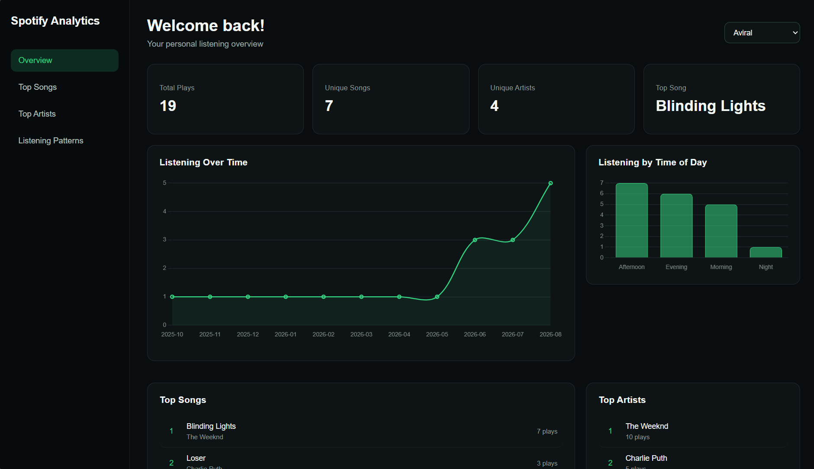
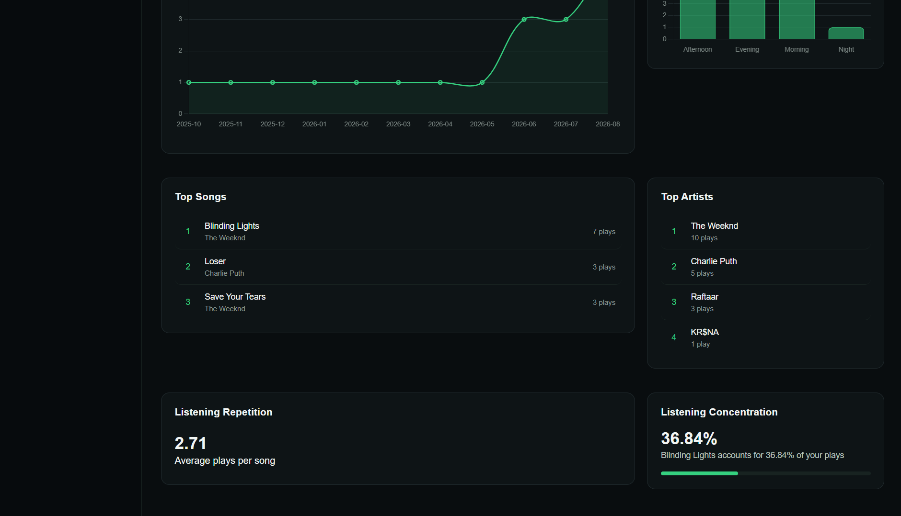
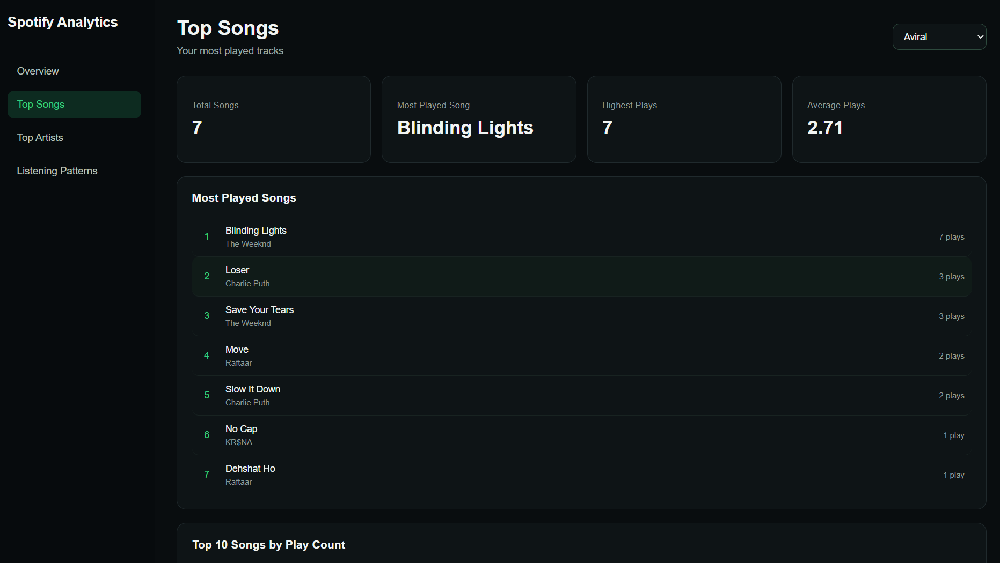
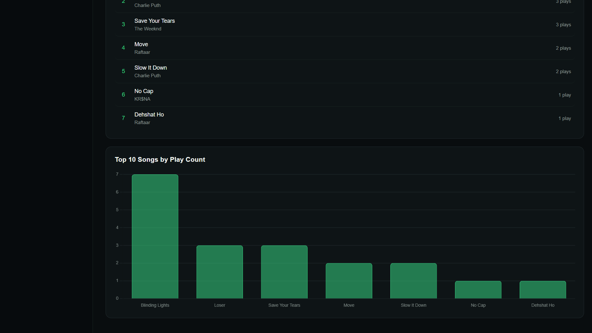
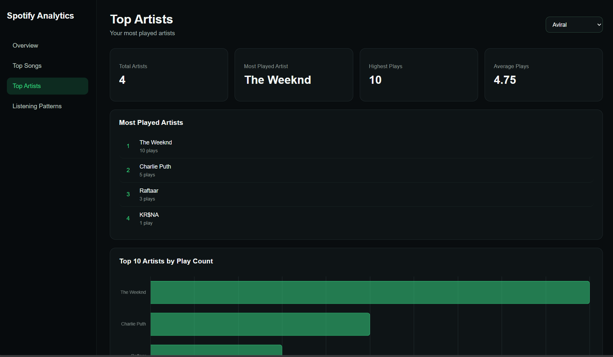
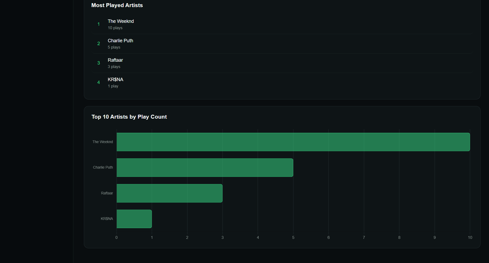
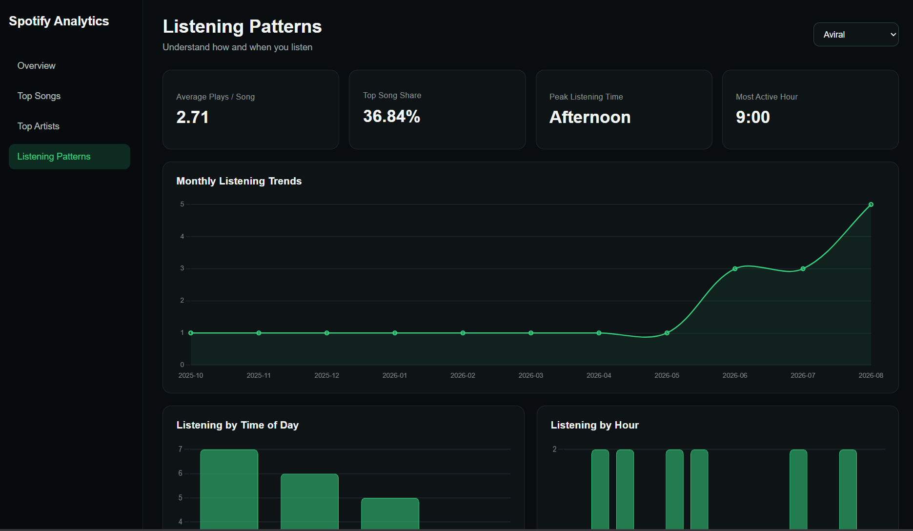
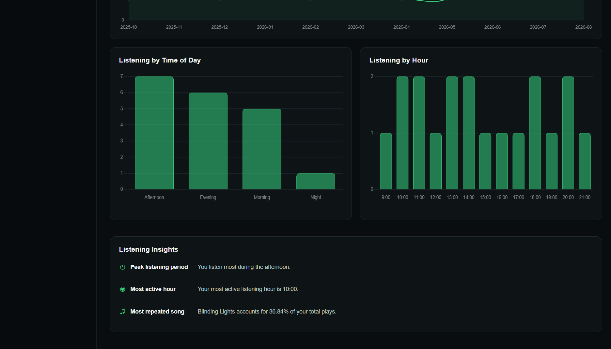

# 🎵 Spotify Analytics Dashboard

A full-stack Spotify listening analytics dashboard built using **MySQL, Node.js, Express, HTML, CSS, JavaScript, and Chart.js**.

The project analyzes listening-history data and presents meaningful insights through an interactive dashboard where users can switch between different listening profiles.

---

## 📊 Project Overview

The Spotify Analytics Dashboard transforms raw listening-history data into useful statistics and visualizations.

Users can explore:

- Total plays
- Unique songs
- Unique artists
- Most played songs
- Most played artists
- Monthly listening trends
- Listening patterns by time of day
- Listening activity by hour
- Average plays per song
- Top-song listening concentration
- Personalized listening insights

The dashboard communicates with a Node.js/Express backend, which retrieves analytical results from a MySQL database through SQL queries.

---

## 🛠️ Tech Stack

### Frontend

- HTML5
- CSS3
- Vanilla JavaScript
- Chart.js

### Backend

- Node.js
- Express.js
- REST API
- Async/await
- Centralized error handling

### Database

- MySQL
- SQL joins
- Aggregate functions
- GROUP BY
- HAVING
- CTEs
- Window functions
- Ranking queries

---

## 📁 Project Structure

```text
sqlprojectspoti/
│
├── backend/
│   ├── app.js
│   ├── asyncHandler.js
│   ├── db.js
│   ├── errorHandler.js
│   ├── package.json
│   └── package-lock.json
│
├── frontend/
│   ├── common.js
│   ├── index.html
│   ├── listening-patterns.html
│   ├── listeningPatterns.js
│   ├── script.js
│   ├── style.css
│   ├── top-artists.html
│   ├── top-songs.html
│   ├── topArtists.js
│   └── topSongs.js
│
├── sql/
│   ├── artist_rank.sql
│   ├── basic_join.sql
│   ├── data.sql
│   ├── database.sql
│   ├── listening_concentration.sql
│   ├── listening_hours.sql
│   ├── listening_summary.sql
│   ├── monthly_trends.sql
│   ├── song_rank.sql
│   ├── tables.sql
│   ├── top_songs.sql
│   └── user_analysis.sql
│
├── .gitignore
└── README.md
```

---

## 🗄️ Database

The project uses a relational MySQL database containing listening-history information.

The main entities include:

- Users
- Artists
- Tracks
- Listening History

The listening history connects users with the tracks they listen to and stores information used for analytical queries.

---

## 🔎 SQL Analysis

The project uses SQL to generate analytical insights including:

### Top Songs

Identifies the most frequently played songs for each user.

### Top Artists

Calculates artist play counts and ranks artists based on listening activity.

### Monthly Trends

Groups listening activity by year and month to identify changes in listening behavior over time.

### Listening Hours

Analyzes listening activity across different hours of the day.

### Time of Day

Groups listening activity into periods such as afternoon and evening.

### Listening Repetition

Calculates the average number of plays per song.

### Listening Concentration

Measures how much of a user's total listening activity is represented by their most-played song.

### Ranking Analysis

Uses SQL ranking techniques to determine top songs and artists.

---

## 🔌 Backend API

The Express backend exposes REST endpoints used by the frontend dashboard.

| Endpoint | Purpose |
|---|---|
| `/api/users` | Retrieves available users |
| `/api/user-summary` | Retrieves user listening statistics |
| `/api/top-songs` | Retrieves top songs |
| `/api/all-top-songs` | Retrieves the complete ranked song list |
| `/api/top-artists` | Retrieves top artists |
| `/api/listening-hours` | Retrieves listening activity by hour |
| `/api/monthly-trends` | Retrieves monthly listening trends |
| `/api/time-of-day` | Retrieves listening activity by time of day |
| `/api/listening-repetition` | Retrieves song repetition statistics |
| `/api/listening-concentration` | Retrieves top-song concentration |

The frontend communicates with these endpoints using the JavaScript `fetch()` API.

---

## 📈 Dashboard Pages

### Overview

Provides a high-level summary of a user's listening activity.

Includes:

- Total plays
- Unique songs
- Unique artists
- Top song
- Listening trends
- Time-of-day activity
- Top songs
- Top artists
- Listening repetition
- Listening concentration

### Top Songs

Provides a detailed ranking of a user's most-played songs.

Includes:

- Total songs
- Most played song
- Highest play count
- Average plays
- Ranked song list
- Top 10 songs chart

### Top Artists

Provides a detailed ranking of the user's most-played artists.

Includes:

- Total artists
- Most played artist
- Highest play count
- Average plays
- Ranked artist list
- Top 10 artists chart

### Listening Patterns

Analyzes when and how the user listens.

Includes:

- Average plays per song
- Top-song share
- Peak listening period
- Most active hour
- Monthly listening trends
- Time-of-day chart
- Hourly listening chart
- Personalized listening insights

---

## 🖥️ Dashboard Preview

### Overview




### Top Songs




### Top Artists




### Listening Patterns




---

## ▶️ How to Run

### 1. Clone the repository

```bash
git clone <your-repository-url>
cd sqlprojectspoti
```

### 2. Install backend dependencies

```bash
cd backend
npm install
```

### 3. Configure the database

Create the MySQL database and tables using the SQL files in the `sql/` directory.

Configure your database credentials in:

```text
backend/.env
```

Example:

```env
DB_HOST=localhost
DB_USER=your_username
DB_PASSWORD=your_password
DB_NAME=spotify_analytics
```

### 4. Start the server

From the project root:

```bash
node backend/app.js
```

The application will be available at:

```text
http://localhost:3000
```

---

## 🔐 Environment Variables

Sensitive configuration is stored in `.env` and excluded from Git using `.gitignore`.

The following files are intentionally not committed:

```text
backend/.env
backend/node_modules/
```

---

## 🚀 Future Enhancements

The current version uses a sample listening-history dataset.

Planned improvements include integration with the **Spotify Web API**.

Future versions will allow users to:

- Sign in using their Spotify account
- Authenticate using Spotify OAuth
- Retrieve their own Spotify listening data
- Display personalized Spotify analytics
- Replace the current manual user selection with Spotify account authentication
- Expand the dashboard using live Spotify data

---

## 🎯 Learning Outcomes

This project demonstrates practical experience with:

- Relational database design
- SQL data analysis
- Complex SQL queries
- Joins and aggregations
- CTEs and window functions
- REST API development
- Express middleware
- Asynchronous JavaScript
- Frontend/backend communication
- Dynamic dashboard development
- Data visualization with Chart.js
- Error handling
- Git and GitHub workflow

---

## 👨‍💻 Author

Aviral Verma

Built as a full-stack SQL analytics project to explore data analysis, backend development, and interactive data visualization.